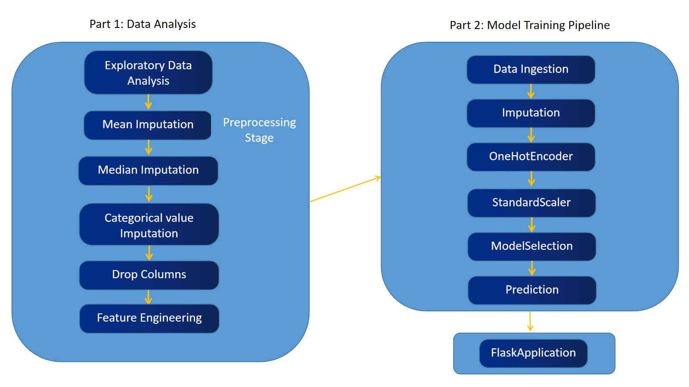

## End to End Machine Learning Project. (Supervised Learning) 

## Predicting-Players-Rating-Using-Machine-Learning

This project aims to predict players overall rating based on various factors such as gender, height, skill moves, mentality, vision and many more features. The machine learning model trained on a dataset of FIFA 21 players dataset can provide insights into predicting a player's overall rating in mathematics.

## Table of Contents

- [Introduction](#introduction)
- [Features](#features)
- [Installation](#installation)
- [Usage](#usage)
- [Dataset](#dataset)
- [Model Training](#model-training)
- [Results](#results)

## Introduction

In today's date understanding the factors which contribute to players overall rating is crucial for everyone who is involved in team building exercise, such as Managers, scouts and coaches. This is crucial because it helps them to make better informed decisions on making best lineup for the forth coming seasons. This project leverages machine learning techniques to predict overall rating of player based on the various factors. By providing accurate prediciton, this tool can help players as well as Management department to identify players who need additional support or change in their training methods to focus on key areas to strengthen their particular ability.

**Note: This Project is for Educational Purpose Only**

The overall rating Predictor project is developed for educational purposes to showcase the application of machine learning techniques in predicting player's performance. The results obtained from this project are based on a specific dataset and machine learning model, and should not be considered as definitive or accurate predictions for real-world scenarios. The primary goal of this project is to demonstrate the end-to-end process of developing a machine learning model and provide insights into the factors influencing player's performance.

## Features 
- Predict players overall rating in mathematics based on multiple factors.
- Provides insights into the influence of following features:
- age, height, probable potential, value eur, preferred foot, weak foot, skill moves, attacking heading accuracy, 
skill dribbling, skill ball control, movement reactions, power jumping, power strength, mentality vision, pace, work rate, team position.
- User-friendly interface for inputing student information and obtaining predictions.

## Installation

1. Clone this repository: `git clone https://github.com/atharva07/FIFA2020_ML_Project.git`
2. Navigate to the project directory. `cd FIFA2020_ML_Project`
3. Install the required dependencies: `pip install -r requirements.txt`

## Usage

1. Run the application: `python app.py`
2. Access the web interface in your browser at `http://localhost:5000`
3. Fill in the players information and submit the form to obtain the predicted overall rating.

## Dataset

The dataset used for training the machine learning model is sourced from [Kaggle - FIFA 21 Complete player dataset](https://www.kaggle.com/datasets/stefanoleone992/fifa-21-complete-player-dataset). It contains information about player's different attributes like age, height, wage, value in euros, skill moves and other different attributes which are essential for analysis of player and making informed decisions.

## Model Training

## Results

- R2-Score: 92%
